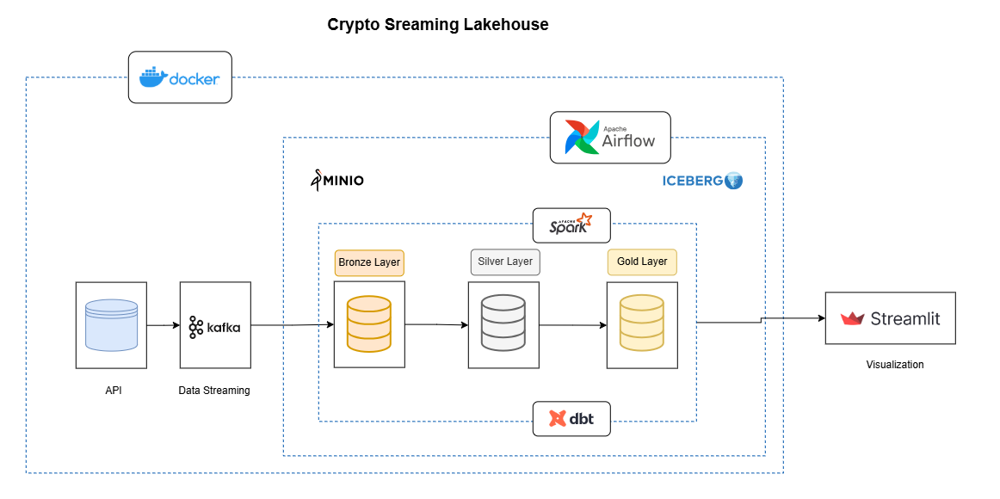
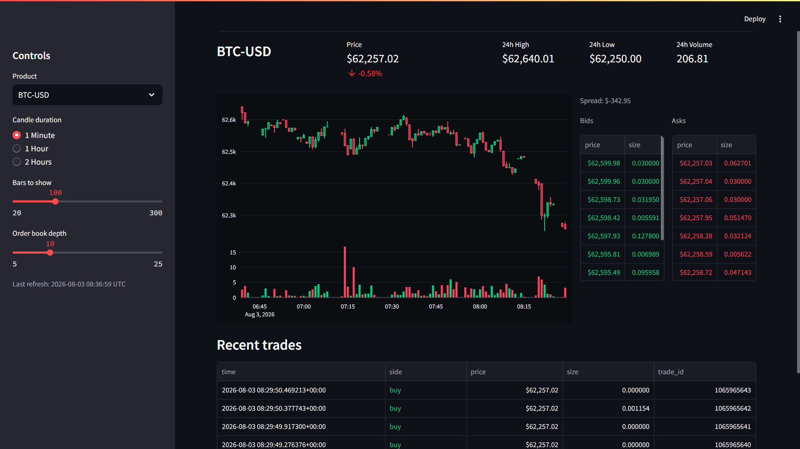

# Crypto Streaming Lakehouse

A fully local, real-time data lakehouse that ingests live crypto market data from Coinbase's public WebSocket feed, lands it through a Kafka → Spark Structured Streaming → Apache Iceberg medallion pipeline, transforms it with dbt, and serves it through a live trading-style dashboard — all running on Docker, with zero paid APIs and zero cloud spend.

*[Architecture](#architecture).*


*Screenshot of the running dashboard.*



---

## Table of Contents

- [Why this project](#why-this-project)
- [Architecture](#architecture)
- [Tech stack](#tech-stack)
- [Project structure](#project-structure)
- [Getting started](#getting-started)
- [Running the pipeline](#running-the-pipeline)
- [The dashboard](#the-dashboard)
- [Orchestration with Airflow](#orchestration-with-airflow)
- [Design decisions and why they were made](#design-decisions-and-why-they-were-made)
- [Cost](#cost)
- [Known limitations](#known-limitations)
- [Extending this project](#extending-this-project)
- [License](#license)

---

## Why this project

Most data engineering portfolio projects use static or synthetic datasets. This one deliberately doesn't: it ingests a **real, live, public market-data feed** (Coinbase's Exchange WebSocket API), which means it has to actually solve the problems a production streaming system has to solve — out-of-order delivery, sequence gaps, reconnect/resubscribe logic, schema drift between message types, and exactly-once-ish landing semantics — rather than problems invented for the sake of an exercise.

It demonstrates, end to end:
- Real-time ingestion from an external streaming API (not a file, not a batch export)
- A genuine medallion architecture (bronze/silver/gold) on an open table format (Apache Iceberg), not a proprietary warehouse
- Order-book reconstruction from incremental exchange updates
- CDC-style upserts (`MERGE INTO`) versus append-only aggregation, applied to the two categories of data that actually need each
- A BI/consumption layer that reads the lake directly, with no SQL engine in the loop
- Orchestration of the batch half of a mixed streaming+batch pipeline

## Architecture

```
Coinbase Exchange WebSocket (level2_batch + matches + heartbeat, public, no API key)
        │
        │  kafka_producer.py  (WebSocketApp, ping/pong keepalive, sequence-gap detection,
        │                      reconnect with backoff, ordered-per-product Kafka keys)
        ▼
   Kafka topics: orderbook_updates, trades   (KRaft mode, no Zookeeper)
        │
        │  bronze_stream.py  (Spark Structured Streaming, two concurrent queries)
        ▼
   Iceberg bronze tables: demo.bronze.orderbook_events, demo.bronze.trades
   (MinIO/S3 storage, Iceberg REST catalog, append-only, raw-preserving)
        │
        │  dbt-spark models (incremental / MERGE)
        ▼
   Iceberg silver tables: demo.silver.stg_orderbook_levels, demo.silver.stg_trades
   (deduplicated, flattened, upserted current state)
        │
        │  dbt-spark models (table, rebuilt each run)
        ▼
   Iceberg gold tables: demo.gold.gold_ohlcv_1min, demo.gold.gold_top_of_book
   (1-minute OHLCV/VWAP bars, best bid/ask + spread)
        │
        │  PyIceberg (direct REST catalog + S3 reads — no Spark/Trino/DuckDB/Postgres)
        ▼
   Streamlit dashboard (candlesticks, order book depth, live trades tape)
```

Orchestration (Airflow) sits alongside this, scheduling the **batch half** (`dbt run`/`dbt test`) on a recurring interval — the streaming ingestion (producer + `bronze_stream.py`) runs continuously as its own long-lived process, which is the correct split: you don't "schedule" a streaming job the way you schedule a transformation.

## Tech stack

| Layer | Technology | Role |
|---|---|---|
| Ingestion | Python, `websocket-client`, `kafka-python` | WebSocket → Kafka bridge |
| Message broker | Apache Kafka (KRaft mode) | Durable, ordered buffer between ingestion and processing |
| Stream processing | Apache Spark (Structured Streaming) | Kafka → Iceberg, bronze layer |
| Table format | Apache Iceberg | Open, engine-agnostic table format with schema evolution, time travel, ACID |
| Catalog | Iceberg REST Catalog (JDBC/SQLite-backed) | Table/namespace metadata, persisted to a Docker volume |
| Object storage | MinIO | S3-compatible storage for all Iceberg data files |
| Transformation | dbt-spark | Silver (cleaning/dedup/CDC-style merge) and gold (aggregation) layers |
| Orchestration | Apache Airflow 3 | Schedules the batch transformation layer |
| Consumption | PyIceberg, pandas, Streamlit, Plotly | Reads the lake directly and renders a live dashboard |
| Infrastructure | Docker Compose | Runs the entire stack locally |

## Project structure

```
crypto_stream_lakehouse/
├── docker-compose.yml
├── .env
├── Dockerfile.airflow
├── airflow/
│   └── dags/
│       └── crypto_lakehouse_dbt.py
├── spark/
│   ├── Dockerfile
│   ├── entrypoint.sh
│   ├── conf/spark-defaults.conf
│   └── jobs/
│       ├── kafka_producer.py
│       ├── bronze_stream.py
│       └── bootstrap_namespaces.py
├── dbt/
│   ├── Dockerfile
│   └── project/
│       ├── dbt_project.yml
│       ├── profiles.yml
│       ├── macros/get_custom_schema.sql
│       └── models/
│           ├── sources.yml
│           ├── silver/
│           │   ├── stg_trades.sql
│           │   └── stg_orderbook_levels.sql
│           └── gold/
│               ├── gold_ohlcv_1min.sql
│               └── gold_top_of_book.sql
└── dashboard/
    ├── dashboard.py
    ├── requirements.txt
    └── .streamlit/config.toml
```

## Getting started

### Prerequisites

- Docker Desktop (with WSL2 backend, if on Windows)
- Python 3.10+ on your host machine (for the dashboard only — everything else runs in containers)
- ~4 GB of free RAM for the Docker stack

### Setup

```bash
git clone <this-repo>
cd crypto_stream_lakehouse
docker compose up -d --build
```

Give it some time on first boot. Confirm everything is healthy:
```bash
docker compose ps
```

## Running the pipeline

```bash
# 1. Start the Coinbase -> Kafka bridge (backgrounded)
docker compose exec -d spark-iceberg python /home/jobs/kafka_producer.py --product-ids BTC-USD ETH-USD

# 2. Start the bronze streaming job (leave running in its own terminal)
docker compose exec spark-iceberg spark-submit /home/jobs/bronze_stream.py

# 3. Transform bronze -> silver -> gold
docker compose exec dbt dbt run
```

## The dashboard

```bash
cd dashboard
pip install -r requirements.txt
streamlit run dashboard.py
```

Opens at `http://localhost:8501`. Features:
- Candlestick + volume chart, resampled client-side to 1 minute / 1 hour / 2 hour bars
- Live order book depth chart and bid/ask ladders
- Color-coded recent trades tape
- A ticker-style header with 24h high/low/volume/change

Reads happen entirely through **PyIceberg**, directly against the Iceberg REST catalog and MinIO — no Spark, Trino, DuckDB, or Postgres involved in serving the dashboard.

## Orchestration with Airflow

Airflow (`http://localhost:8086`) schedules `dbt run` + `dbt test` on a fixed interval via the `crypto_lakehouse_dbt` DAG — it does **not** manage the streaming jobs, which are long-running services started independently. See `airflow/dags/crypto_lakehouse_dbt.py`.

## Design decisions and why they were made

**Why Apache Iceberg instead of writing to a database or plain Parquet.** Iceberg gives ACID guarantees, schema evolution, and hidden partitioning on top of plain object storage, and — critically — it's engine-agnostic: the same tables are readable by Spark, Trino, PyIceberg, or anything else that speaks the Iceberg spec. No engine owns the data.

**Why the REST catalog instead of a Hive Metastore.** Simpler to run locally, and it's the direction the Iceberg ecosystem itself has moved (it's what Snowflake, Databricks Unity Catalog, and AWS S3 Tables all speak). The tradeoff: the reference implementation used here (`apache/iceberg-rest-fixture`) is explicitly a test fixture with a SQLite backing store by default — fine for one writer, not built for high concurrency (see [Known limitations](#known-limitations)).

**Why bronze stores raw JSON alongside typed columns for order-book events, but not for trades.** Snapshot and incremental order-book messages have genuinely different shapes (`bids`/`asks` arrays vs. a `changes` array); keeping the original JSON string means a schema surprise doesn't lose data, and flattening happens once, deliberately, in the silver layer. Trade messages have one stable shape, so there's less reason to defer parsing — though a raw fallback column was added there too, once it became clear consistency was worth more than the small storage cost.

**Why `MERGE INTO` for silver, but full-rebuild `table` materialization for gold.** Order book levels and trades are genuinely mutable/append-with-dedup at the row level — `MERGE` is the correct primitive. Gold aggregates are cheap to recompute in full and don't carry incremental state worth preserving, so a straightforward rebuild is simpler and just as correct.

**Why PyIceberg for the dashboard instead of routing through Spark/Thrift.** A read-only consumption layer shouldn't need a JVM and a Hive-protocol session just to read a small aggregate table — and pragmatically, PyIceberg's pure-Python dependency chain avoids a real Windows-specific problem (`PyHive`'s `sasl` dependency requires a C compiler that isn't installed by default on Windows).

**Why the order book keeps `size = 0` rows instead of deleting them.** dbt-spark's default incremental `merge` strategy has no native `DELETE` branch. Rather than write a custom merge statement for a learning project, removed price levels are kept as zero-size rows and filtered (`size > 0`) by every downstream consumer — an explicit, documented tradeoff rather than a silent one.

## Cost

Every component here is open-source and runs entirely on your own machine — **there is no cloud spend to run this project as built.** The only real cost is your machine's compute and the electricity to run Docker Desktop for however long you leave the stack up.

If you wanted to run an equivalent architecture in production on a cloud provider, the cost drivers would be:
- **Compute** for Spark (a managed Spark service, or a small persistent cluster) and for the orchestrator
- **Object storage** (S3 or equivalent) — typically the cheapest line item at this data volume
- **A managed or self-hosted Kafka** (a managed Kafka service is usually the single largest recurring cost in a real deployment of this shape)
- **Catalog service** — a managed Iceberg REST catalog, or the cost of running JDBC catalog infrastructure (e.g., a small RDS instance) reliably
- **Network egress**, if the dashboard or any consumer lives outside the cloud provider's network

Exact figures depend heavily on provider, region, retention period, and message volume, and change often enough that a specific dollar figure here would go stale — use your cloud provider's pricing calculator against your actual expected message volume and retention window rather than trusting a number written into a README.

## Known limitations

- **Iceberg REST catalog persistence is SQLite-backed**, which is fine for a single writer but not built for concurrent-write robustness — there's a documented upstream issue about errors under concurrent access. A future iteration would move this to a Postgres-backed JDBC catalog.
- **Single Kafka broker, no replication** — appropriate for local development, not for anything resembling production durability.
- **Resampled OHLCV durations (1h/2h) approximate VWAP** as a volume-weighted average of the underlying 1-minute bars' VWAPs, rather than recomputing from raw trades — very close, not mathematically identical.
- **No automated monitoring of the streaming jobs' liveness** — if `bronze_stream.py` dies, nothing currently alerts you; Airflow only orchestrates the batch (dbt) half.
- **Order book "deletions" are soft** (`size = 0` rows), not true deletes, due to dbt-spark's default merge strategy — see [Design decisions](#design-decisions-and-why-they-were-made).

## Extending this project

- **Add a second exchange** (e.g., Kraken) for cross-exchange spread/arbitrage analysis — the Kafka key convention (`exchange:product_id`) and bronze-layer routing pattern are designed to support this; watch for heterogeneous payload shapes landing in one topic if you go this route.
- **Swap the REST catalog's backing store to Postgres** for real concurrent-write support.
- **Add dbt tests** (`not_null`, `unique`, `accepted_values`) now that the schemas are stable against live data rather than synthetic data that never breaks.
- **Add a streaming-job health-check DAG** in Airflow, separate from the dbt-scheduling DAG.
- **Point a Trino catalog at the same Iceberg REST catalog and warehouse** to add a second, SQL-native query engine with zero data movement.


---

## License
 
MIT — see `LICENSE`. Market data is sourced from Coinbase's public Exchange WebSocket API; review Coinbase's own market data terms before any use beyond local/personal learning.


---

Zeinab Gouyandeh